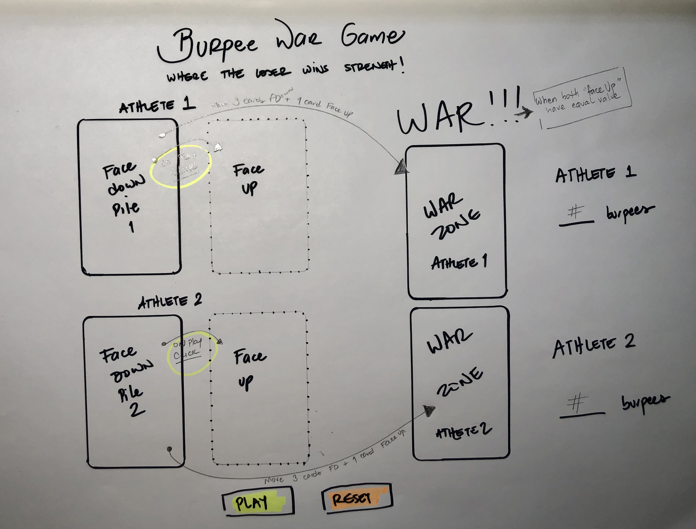

# Burpee War
### Where it's all about winnning strength!

---

February 2020/MBJaeger

---

### Description

This game is inspired by the conventional War Game, where there are two players, one full deck of cards and chances to win or lose, depending on who gets the highest flipped card.

Our Burpee War version of the game is intended to be quick because our *goal* is to **create a fun and interactive way to challenge players to improve their physical strength and move throughout the day.** 

This our favorite part of the game: 

### **The more you win, the stronger you become!**

You’ll have contradicting feelings when playing this game, because who has ever said "I feel like doing lots of burpees today!"? We get it! Probably nobody EVER. Just keep in mind that the more you win, the stronger you'll become!

---

### Game Rules:

1) You play to WIN burpees - Be excited about that! 

 2) Hit “PLAY” to show a new card. 

3) On each hand played, three burpees are assigned to the player with the highest card value, zero to the player with the lowest card value. 

4) When a player reaches 15 burpees the game ENDS.

 6) Both players get to do the amount of burpees on their scoreboard (the loser will always have 15).

---

### Screenshots

---

### Technologies Used

- HTML
- CSS
- JavaScript

---

### Future Updates

- [ ]  Improved design features.
- [ ]  Workout music to play during burpees.
- [ ]  Screenshots of game in the description.
- [ ]  Refresh game button.

---

### Our recommendation

Play this game daily! It will help you get your body moving, become stronger and release happy hormones!

Have fun and we hope you lose often!

Visit our page: [https://mbjaeger.github.io/war/](https://mbjaeger.github.io/war/)